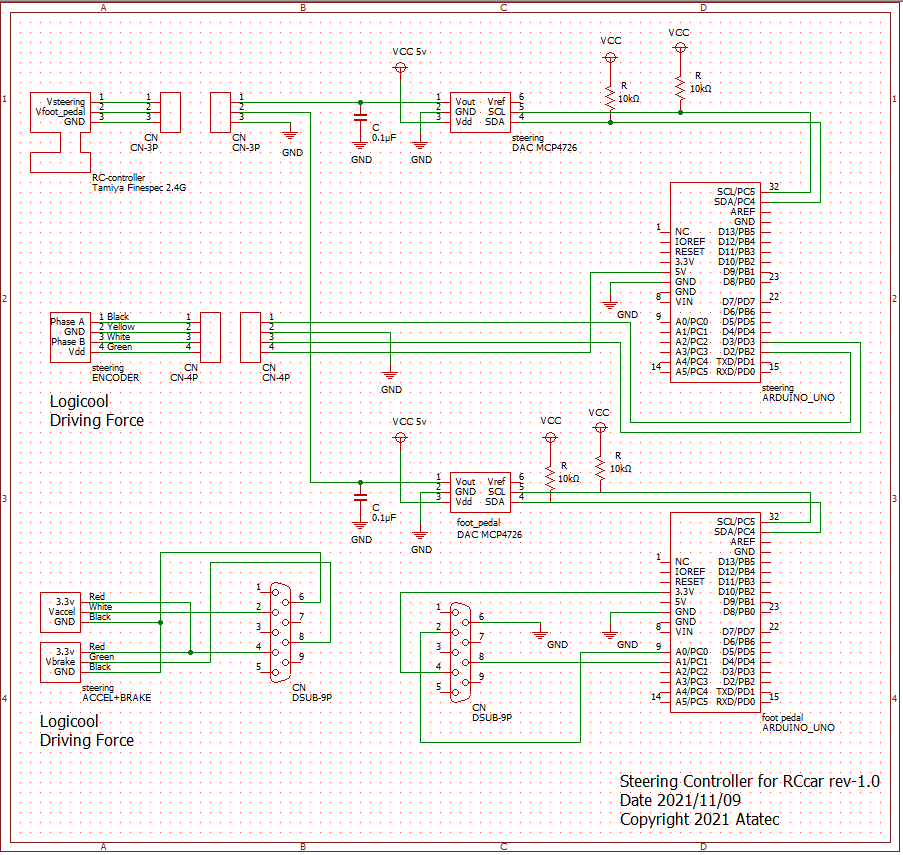

# Steering_Controller_for_RCcar
How to make the steering controller for RC car
ラジコンカー用ステアリングコントローラー制作
 
(執筆中。少しずつ更新していく予定)
## 概要
* ラジコンカーをステアリングコントローラーで操作できるようにする。
* 市販のステアリングコントローラーをプロポに接続するためのアダプターを制作。

## システム概要

動作フローは以下。
 
### ステアリング制御
 

1. ステアリングコントローラーのエンコーダパルスをarduinoへ入力し、ステアリング現在位置を取得。
2. ステアリング現在位置をプロポの電圧レンジに変換する。
3. 変換値をarduinoからDAコンバータ（mcp4726）へI2Cで送信する。
4. DAコンバータからアナログ電圧をプロポへ出力する。

### アクセル制御
 

1. ステアリングコントローラーのアクセルペダル、及びブレーキペダルのアナログ電圧をarduinoへ入力し、ペダル踏み込み量を取得。
2. ペダル踏み込み量をプロポの電圧レンジに変換する。
3. 変換値をarduinoからDAコンバータ（mcp4726）へI2Cで送信する。
4. DAコンバータからアナログ電圧をプロポへ出力する。

### 回路図
電源は9v,5v,3.3vを使い分けているため注意のこと。
 

## 使用アイテム
* RCカー：1/10スケール　タミヤ　コミカルマイティフロッグ
* プロポ：fine spec 2.4G
* ステアリングコントローラー：Logicool
* arduino uno ×２個
* DAコンバータ　×２個
* カーボン抵抗　×２個
* セラミックコンデンサ　×２個
* D-sub9ピンコネクタ

## 製作手順
### プロポ改造
1. プロポを分解し、ステアリングとアクセルのコントロール用の可変抵抗を取り外す。プロポにもよるが、基盤に直接3点止めで半田付けされているため、半田吸引器が必須。
2. 
### ステアリングコントローラ
1. エンコーダの仕様を確認する。4線であれば、おそらくA相、B相、電源、グランドの組合せ。オシロスコープで組合せを確認し、パルス変化があった線をロジックアナライザで分析する。
2. 

### 変換基盤の製作

## パラメータ調整
変換後出力電圧が下表のプロポ電圧になるよう、
ソースコードのパラメータを調整する。
パソコンに接続してシリアルモニタで調整するが、
パソコンからのUSB給電時と
実際の外部電源を使用した時とでは電圧降下量が違うため、
外部電源使用時に目標電圧になるようパラメータを調整する。

### プロポの電圧
#### フットペダル
|  | OFF | ON |
| ---- | ---- | ---- |
| アクセル | 1.787v | 0.999v |
| ブレーキ | 1.787v | 2.406v |

#### ステアリング

|  | 左max | 中央 | 右max  |
| ---- | ---- | ---- | ---- |
| ステアリング | 2.770v | 1.694v | 0.547v |

### ステアリングコントローラ

#### フットペダル
|  | OFF | ON |
| ---- | ---- | ---- |
| アクセル | 2.803v | 0.280v |
| ブレーキ | 0.480v | 3.080v |

#### ステアリング

|  | 左max | 中央 | 右max  |
| ---- | ---- | ---- | ---- |
| ステアリング | 2.907v | 1.972v | 1.110v |
